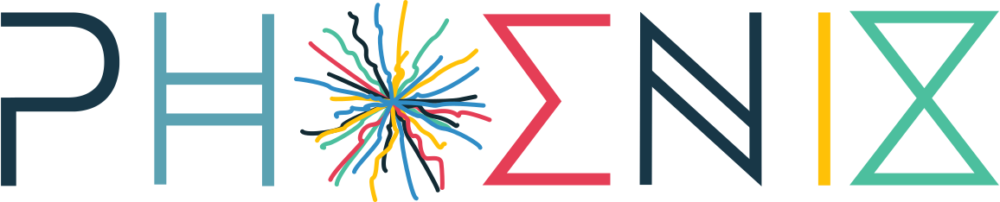
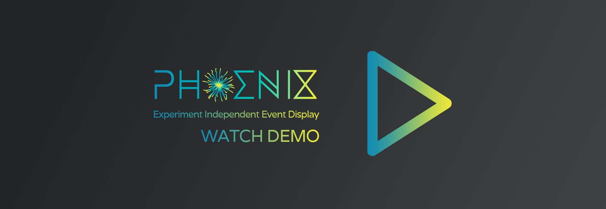

[![Build Status][build-img]][build-link]
[![License][license-img]][license-url]

[build-img]: https://travis-ci.com/HSF/phoenix.svg?branch=master
[build-link]: https://travis-ci.com/HSF/phoenix
[license-img]: https://img.shields.io/github/license/hsf/phoenix.svg
[license-url]: https://github.com/hsf/phoenix/blob/master/LICENSE

# Phoenix Project

The idea of this project is to have a simple way to visualise event and geometry data using nothing more than a web browser. The data should be as detector-agnostic as possible.
Technically the 3D is done with [three.js](https://threejs.org), the menu (at the moment) uses [DAT.GUI](https://code.google.com/archive/p/dat-gui/) and the data format is just plain JSON.

This project was generated with [Angular CLI](https://github.com/angular/angular-cli) version 7.3.4.

You can see an online version at [https://hepsoftwarefoundation.org/phoenix/](https://hepsoftwarefoundation.org/phoenix/)

## Demo

## Build and install

This is an [Angular](https://angular.io) application, so you will need to have [Node js](https://nodejs.org/en/) and [Angular CLI](https://github.com/angular/angular-cli) installed locally.

You can follow [this guide](https://angular.io/guide/setup-local) to set up your local environment.

Once everything is set up, run `ng serve` from the command line in the project directory for a dev server. Then navigate to `http://localhost:4200/` from your browser.
The app will automatically reload if you change any of the source files.

## Documentation

* [User manual.](./src/assets/docs/users.md)
* [How to contribute.](./CONTRIBUTING.md)
* [Developer guide.](./src/assets/docs/developers.md)

## Contact

This is still very much a work in progress, so let me know of any problems (and don't be too surprised if there are some).

edward.moyse@cern.ch
