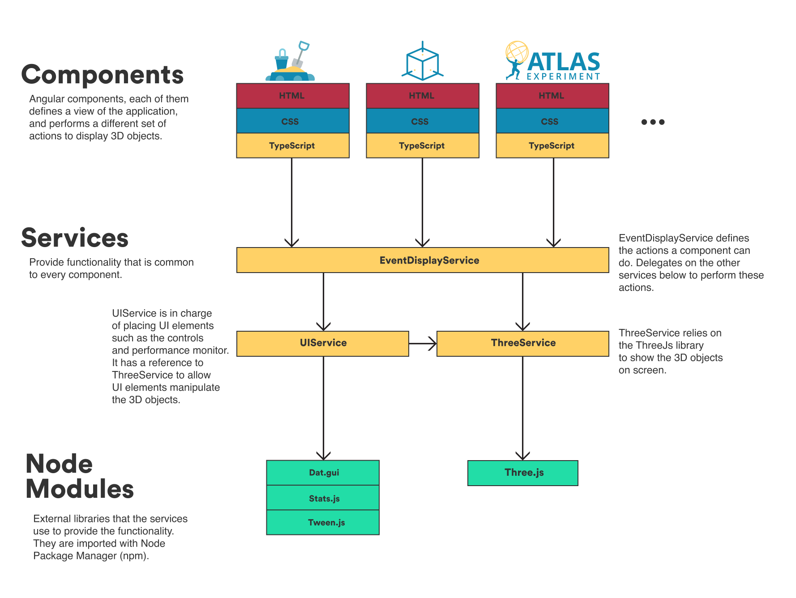

# Developer guide

## Setting up the environment
This is an [Angular](https://angular.io) application, so you will need to have [Node js](https://nodejs.org/en/) and [Angular CLI](https://github.com/angular/angular-cli) installed locally.

You can follow [this guide](https://angular.io/guide/setup-local) to set up your local environment.

Once everything is set up, run `ng serve` from the command line in the project directory for a dev server. Then navigate to `http://localhost:4200/` from your browser. 
The app will automatically reload if you change any of the source files.

## Application architecture
This is an overall model of the architecture of the application (we will try to keep it up to date, but beware that some things may not be completely up to date).

### Components
