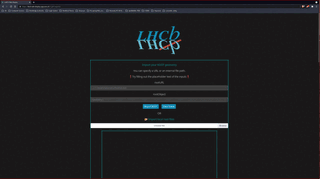

# Convert GDML Geometry to ROOT and GLTF

## Introduction

It seems that a need has arose to convert GDML geometry files to a particular file format that describes a geometry,
that can be supported and visualized properly by Phoenix. 
Hopefully by following the steps bellow you will be able to achieve it. 
Please do open an [issue](https://github.com/HSF/phoenix/issues) in case of problems, where friendly folks can try and help. 

### Convert GDML to ROOT 

Root will serve as a middleman for our purpose. 
Root is a C++ Data Analysis Framework. One needs to install it first locally by heading into Root's 👉 [Documentation](https://root.cern/install/) and following the steps listed over there. 

Once that is done, one can write a simple C++ function that will loop over the contents of the GDML file and with the help of some of the ROOT's Framework methods it will output a proper .root file with the name specified, which we will later on use to convert it into GLTF format and visualize it into Phoenix. 

The following C++ code works and serves for the above mentioned purpose. In case of problems please do open an issue and someone will try and help! 

```c++
void gdml_to_root_export() 
{
    // Loading the library and geometry
    gSystem->Load("libGeom");
    TGeoManager::Import("./path_of_your_gdml_file.gdml");
    gGeoManager->SetVisLevel(4); /// the number here can be changed based on the depth of the visibility level of your gdml file and the detail that you want to visualize it. 

    // Export the geometry
    gGeoManager->Export("filename.root");
}
```

> Keep in mind that in order for the above function to work, you should have installed the C++ ROOT Framework on your machine. 

Compiling and running the above code should result in outputting the .root file from your .gdml input. 

#### Verify that the .root file is extracted properly. 

One can visualize the .root file itself to be sure that it was extracted properly. 
We'll provide 2 tools one can use here and one of them is Phoenix itself.

> But why convert to .gltf since Phoenix supports .root visualization? 

.root visualization will result into a poor visualization image and also not that great of performance. Also another good reason to not stick with .root is that one can not split the .root file itself into multiple sub-parts / sub-geometries thus eliminating one of the core functionalities of Phoenix into geometry visualization. And thus a new tool was created for this very purpose. 

### ROOT to GLTF [web-based tool](https://lhcb-web-display.app.cern.ch/#/gltf-exporter) 

On the following 👉 [website](https://lhcb-web-display.app.cern.ch/#/gltf-exporter) you will find the new web-based tool that was created so you can first verify that your .root file was extracted properly and then translate it into `.gltf` so you can visualize it properly inside Phoenix. 

There is enough information in the website itself, so you won't get lost but some quick steps to follow in order, would be: 

1. Import your local .root file.
2. Do type the particular root object string in the empty box and click the button `Import root`.
3. Do wait a couple of seconds and it should load automatically and you'll be able to see it visualized properly. 
4. `If you don't know where to find the root object name just scroll a bit down on the page and you'll find relevant info.` 
5. Go at the bottom of the page and press the button `export to gltf` (only if you import your root file via a URL. Importing it from your local machine will translate it automatically to gltf)
6. It might take a couple of seconds or minutes (depending on the file size) and then your .gltf file will get downloaded locally automatically. 
7. Upload your .gltf file to the GLTF viewer at the bottom of the page and verify that it was extracted properly. 
8. Go and visualize your file inside Phoenix and play with it! 

> Here's a gif demonstrating the above steps



### Split your GLTF geometry into multiple parts

After extracting our geometry and visualizing into Phoenix we might want to split it into multiple subparts to visualize and play with each part of our geometry seperately. 

To do that one might need to modify some code for his .gltf file but extensive documentation is written for the ease of that purpose over 👉 [here](https://github.com/andrewpap22/root_cern-To_gltf-Exporter)!

Just follow the documentation in the above link and you should be good to split your whole geometry into multiple subparts and be able to visualize into Phoenix each one of them seperately or all together with the option to enable and disable each part from the UI!

Again feel free to open an [issue](https://github.com/HSF/phoenix/issues) if stuck and someone friendly folk will try and help! 