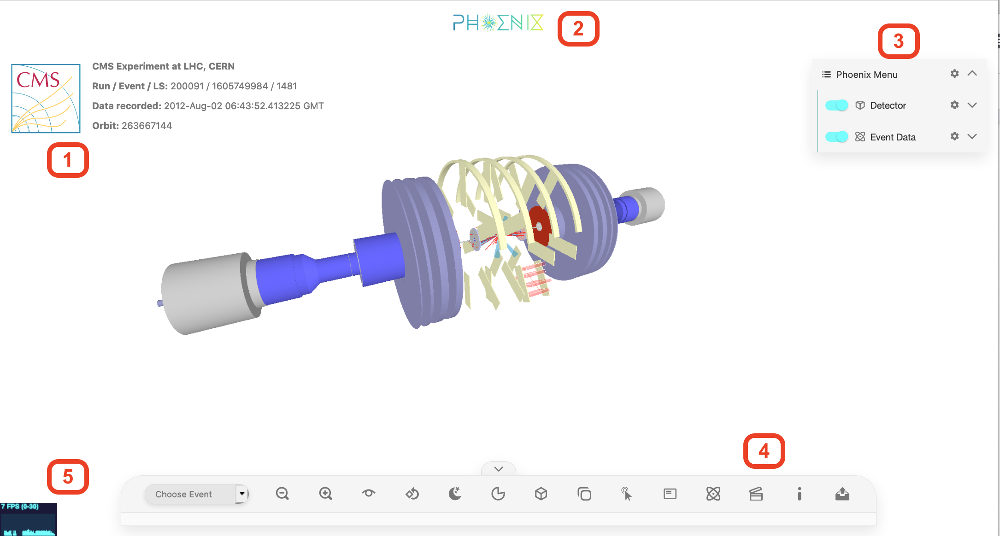
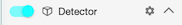
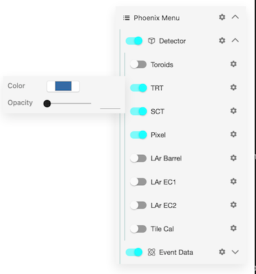
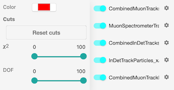
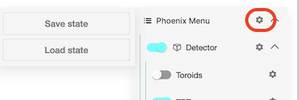
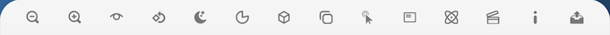
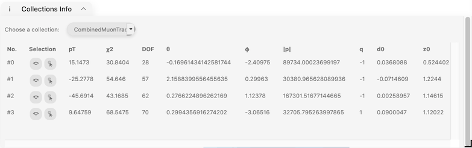
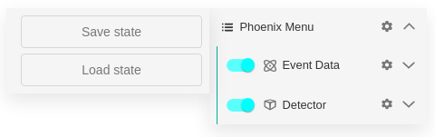
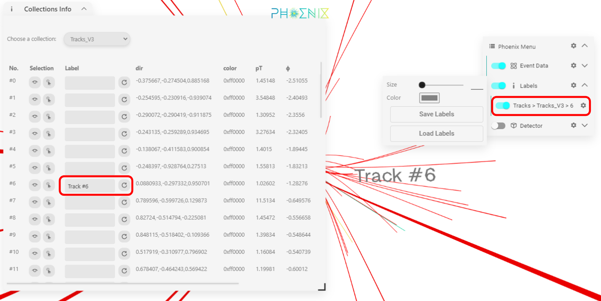

# User manual

* [Getting started](#getting-started)
  * [The demo grid](#the-demo-grid)
  * [The Phoenix standard UI](#the-phoenix-standard-ui)
  * [The Phoenix menu](#the-phoenix-menu)
  * [The Phoenix iconbar](#the-phoenix-iconbar)
    * [Collections info panel](#collections-info-panel)
  * [Keyboard controls](#keyboard-controls)
  * [AR/VR mode](#arvr-mode)
  * [Event display state](#event-display-state)
  * [Labels](#labels)
  * [URL options](#url-options)
* [Using Phoenix with your own data](#using-phoenix-with-your-own-data)
  * [Event data](#event-data)
    * [Format](#format)
    * [Supported object types](#supported-object-types)
  * [Geometry](#geometry)

## Getting started

### The demo grid

When you first open the Phoenix [demo](https://hepsoftwarefoundation.org/phoenix) (see the developer [instructions](../guides/developers.md) for how to check it out and run locally) you will see a grid of Phoenix demos:

  * **Playground** : a blank canvas where you can load 3D objects, move them around and generally experiment with Phoenix
  * **Geometry display** : a simple demo of generating geometry procedurally/programmatically with Phoenix
  * **ATLAS** : the ATLAS experiment demo. Here you can load `Phoenix JSON` or `JiveXML` event data files, and visualise physics objects such as Jets, Tracks, Calo cells etc within the ATLAS geometry.
  * **LHCb** : the LHCb experiment demo shows a detailed view of the LHCb geometry, as well as tracks passing through it.
  * **CMS** : the CMS experiment demo. Here you select from various event data files, and visualise physics objects such as Jets, Tracks, Calo cells etc within the CMS geometry. One special feature of the CMS demo is the visualisation of Muon Chambers.
  * **TrackML** : this shows the imaginary detector created for the TrackML [challenges](https://www.kaggle.com/c/trackml-particle-identification).
  
### The Phoenix standard UI

Since Phoenix is configurable, it is not guaranteed that all demos/implementations will look the same, but a typical Phoenix view is shown below:



In the centre, you see the 3D view of the experiment and event data.

Around it, you have:

1. The (configurable) experiment logo and event data
2. The Phoenix logo (which is also a link back to the demo grid)
3. The Phoenix menu (see below for more details)
4. The Phoenix iconbar (see below for more details)
5. The frames-per-second (FPS) graph

In general the Phoenix menu is used to determine what geometry and event data is shown (and how), whilst the iconbar determines how you interact with the geometry and event data.

### The Phoenix menu

All items in the Phoenix menu have the same basic layout:



From left-to-right:

  * A slider, which determines if the item (or the sub-items beneath it) is visible
  * The name of the item
  * A gear icon, to open the options for this item
  * And an arrow to open/collapse sub items.

As an example of options, here is an expanded geometry view:



you can see that we can change the opacity and colour of the geometry item.

Another example of options: here is an expanded event data view, showing how you can apply cuts to track collections:



Another important point: clicking on the gear icon at the very top allows you to save/load the menu configuration.



### The Phoenix iconbar

At the bottom of the main view you have the Phoenix iconbar (which can be shown/hidden by clicking on the arrow on top):



From left to right, you can access the following functions:

   * **Zoom** : the plus/minus icons allow you to zoom in and out, respectively
   * **View options** : clicking on this will allow you to access some preset views, and to view/hide the axes
   * **Auto rotate** : clicking on this will set the camera orbiting the origin
   * **Dark/light theme** : switches between dark and light themes
   * **Geometry clipping** : allows you to 'slice' away parts of the geometry in order to view the event data/geometry inside
   * **Orthographic/perspective view** : allows you to switch between different view modes
   * **Overlay** : enables/disables the view overlay (a separate overlaid view of the detector)
   * **Object selection** : once enabled, a new window will pop up which will display information about selected objects
   * **Info panel** : shows a window displaying relevant information from Phoenix (for example, about events opened)
   * **Collision animation** : starts a simple animation, simulating a collision and subsequent event data appearing
   * **Preset animations** : shows a list of preset animations that can be triggered by clicking on the preset
   * **Collection information** : displays a panel showing textual information about the event data collections (see below)
   * **Performance mode** : clicking on this will turn on performance mode which makes Phoenix faster but decreases quality
   * **VR mode** : will make Phoenix enter Virtual Reality (VR) mode
   * **AR mode** : will make Phoenix enter Augmented Reality (AR) mode
   * **Screenshot mode** : will enter screenshot mode by hiding all overlays
   * **Import/export** : allows you to load new event data, or detector geometry (depending on configuration)
   * **Create shareable link** : opens a dialog for creating a shareable link/URL to the experiment

The AR and VR mode will only be available if your device (or headset) supports AR or VR.

#### Collections info panel



This displays some more details about the various collections. And under the **Selection** column are two icons, which allow you to either zoom the camera to the object, or to select (and highlight) it.

### Keyboard controls

Phoenix support various keyboard controls:

   * **Shift-T** : change theme
   * **Shift-Number** : switch to that numbered preset view
   * **Shift-R** : rotate view
   * **+/-** : zoom
   * **Shift-C** : enable clipping
   * **Shift-V** : switch between orthographic and perspective

### AR/VR mode

Phoenix relies on the WebXR functionality of [three.js](https://threejs.org), so before trying it in Phoenix, it would be a good idea to test the VR/AR demos there.

**VR:** Currently the VR has been tested on the following devices:

   * Android smartphones
   * Oculus Quest (make sure you use the Oculus browser - Firefox reality is currently unusably slow)
   * Oculus Rift S (as of writing, the best option seems to be to use google Chrome canary i.e. beta)

**AR:** On Android you will need the latest version of Chrome. On iOS, you will need to use the [WebXR Viewer from Mozilla](https://apps.apple.com/us/app/webxr-viewer/id1295998056) to make AR work.\
Make sure your device supports AR and is listed here: <https://developers.google.com/ar/devices>

The situation here is rapidly changing, so please let us know if this is out-of-date. Also please note that some features of Phoenix need to be disabled in VR, and it is currently very much a work in progress (help is very much welcomed!).

### Event display state

Phoenix keeps track of the event display state which can be saved as a JSON file and loaded later either from the Phoenix menu or through the URL.

The state includes:

   * Phoenix menu configuration
   * Geometry clipping
   * Camera position

The "Save state" and "Load state" buttons are in the options of top level Phoenix menu node.



### Labels

Labels can be added to individual physics objects from the collections info panel. The configurable options for each label are in the Phoenix menu.

You can also save the added labels in a JSON file from the options of "Labels" Phoenix menu node and load them later.



### URL options

Some options can be passed to the event display through the URL parameters. They are passed through the URL like this:

```
http://localhost:4200/#/atlas?<option_1>=<option_1_value>&<option_2>=<option_2_value>
```

Available options are:

   * **file** : path or URL to the event data file you want to load (requires `type` option)
   * **type** : type of the event data file (for example, `jivexml` or `json`)
   * **config** : path or URL to the config or state file (this is the JSON file you get when you save state from the Phoenix menu)
   * **hideWidgets** : hide all overlay widgets including Phoenix menu and iconbar

For example, event from a JSON event data file served through `/assets/event_data/data.json` can be loaded through the following URL:

```
http://localhost:4200/#/atlas?file=assets/event_data/data.json&type=json
```

## Using Phoenix with your own data

The JSON format is pretty simple, but we're still in the process of documenting it (and it might evolve).

Caveats aside, here are some rough outlines:

### Event data

#### Top level json file format

Currently Phoenix supports loading `.JSON` files containing multiple events. The format is the following.

```js
{
  "EVENT_KEY_1": event_object,
  "EVENT_KEY_2": event_object,
  ...
  "EVENT_KEY_N": event_object
}
```

`EVENT_KEY` is an identifier for each event, and the format of each `event_object` would be as follows: 

```js
{
  "event number": XXX,
  "run number": YYY,
  ...
  "OBJECT_TYPE_1": {
    "COLLECTION_NAME_X" : [ OBJECTS ]
  },
  "OBJECT_TYPE_2": {
    "COLLECTION_NAME_Y" : [ OBJECTS ],
    "COLLECTION_NAME_Z" : [ OBJECTS ]
  }
}
```

Where:

* `event number` and `run number` are hopefully obvious,
* `OBJECT_TYPE` is one of the supported types that will be mentioned [below](#supported-object-types),
* `COLLECTION_NAME` is an arbitrary name used to label this particular collection (you can have as many collections of each OBJECT_TYPE as you like).
* `...` can be any other optional key/value pairs. Phoenix understands by default the following keys which will be used in the event Metadata panel, valuse being free strings :
  * `ls` will be printed for `LS` entry
  * `lumiblock` will be printed for `LumiBlock` entry
  * `time` : will be printed for `Data recorded` entry
  

You can find various examples in the [files folder](../packages/phoenix-ng/projects/phoenix-app/src/assets/files):

* [atlaseventdump2.json](../packages/phoenix-ng/projects/phoenix-app/src/assets/files/event_data/atlaseventdump2.json) is an small multiple event file containing the various objects.
* [EventData.json](../packages/phoenix-ng/projects/phoenix-app/src/assets/files/event_data/EventData.json) is a bigger file containing more events and objects.
* [LHCbEventData.json](../packages/phoenix-ng/projects/phoenix-app/src/assets/files/lhcb/LHCbEventData.json) is a large file containing LHCb simulated events.


#### Supported object types

Currently Phoenix supports the following physics objects:

* Tracks - the trajectory of a charged particle (usually in a magnetic field)
* Jets - cones of activity within the detector
* Hits - individual measurements, which can either be points, lines, or boxes
* CaloClusters - cluters of deposits in a calorimeter
* [Planar]CaloCells - deposits of energy in a calorimeter (planar and cylindrical are supported).
* Vertices - optionally linked to tracks
* MissingEnergy
* Compound objects which link 'Tracks' and 'Clusters' :
  * Muons 
  * Photons
  * Electrons

(other shapes may be supported in the future)

What follows in the detailed format of each object type. Any extra entry is considered as decoration and will not be interpreted by phoenix, although it will be visible by the user. E.g. a Track can have `dof` attribute on top of `pos`, `color`, ...
In all the descriptions, `opt` means that the attribute described is optional.

#### 'Tracks'
Tracks is a list of Track objects with the following attrbutes :
* `pos` - list of positions along the track, each  given as a triplet [x, y, z]
* `color` (opt) - Hexadecimal string representing the color to draw the track.
* `dparams` (opt) - parameters of the tracks. 4 floats matching d0, z0, phi and eta
* `d0`, `z0`, `phi`, `eta`  (opt) - parameters of the tracks, taking precedence over `dparams`

#### 'Jets'
Jets are a list of Jet objects with the following attributes :
* `eta` - eta direction
* `phi`- phi direction
* `theta` (opt) - if not given, eta is used to calculate theta
* `energy`, `et` (opt) - energy of the Jets, used to set its length
* `coneR` (opt) - the radius of the jet cone. If not given, radius is 10% of the length
* `color` (opt) - Hexadecimal string representing the color to draw the jet.

#### 'Hits'
Hits can be defined in 2 ways. Either as an array of positions or as an array of Hit objects.

In case aray of positions is used, Hits have format [ [x,y,z], [x,y,z], [x,y,z], ... ] i.e. an array of 3-dim arrays containing Cartesian coordinate.
These will be rendered as points.

In case of array of Hit objects, format is [ hit, hit, hit ] where the hit object has the following attributes :
* `type` (opt) - type of Hit. One of `Point`, `Line` or `Box`. Defaults to Point
* `pos` - an array of number describing the hit
  * for `Point` type, it should have 3 coordinates : [x, y, z]
  * for `Line` type, it should have 6 coordinates : [x0, y0, z0, x1, y1, z1]
  * for `Box` type, it should have 6 coordinates : [x, y, z, length in x, width in y, height in z]
* `color` (opt) - Hexadecimal string representing the color to draw the hit.
Note that all hit objects in a given Hits collection have to be of the same type.

#### 'CaloClusters' and 'CaloCells'
We are talking here of cylindrical calorimeters, the deposits will be displayed as boxes with fixed square base and length matching the energy. The orientation of the boxes is radial.
'CaloClusters' and 'CaloCells' are lists of CaloCluster and CaloCell objects respectively. These have the same set of attributes :
* `energy` - energy of the cluster or deposit, converted to length of the displayed box
* `phi` - phi direction
* `eta` - eta direction
  
#### 'PlanarCaloCells'
We are talking here of planar calorimeters, the deposits will be displayed as boxes with square base of cellSize and length matching the energy.
These boxes will be positions on a given plane (the plane pf the calorimeter) at the specified coordinates in this plane.

PlanarCaloCells is an object with the following attributes :
* `plane` - the Calorimeter plane, defined as 4 numbers, giving a direction (normal to the plane) and a distance to the origin : [dx, dy, dz, length]
* `cells` - a list of Cell objects with the following attributes:
  * `cellSize` - size of the Calorimeter cell which fired
  * `energy` - energy of the deposit, converted to length of the displayed box
  * `pos` - position of the cell within the calo plane given as a pair [x, y]
  * `color` (opt) - Hexadecimal string representing the color to draw the cell.

#### 'Vertices
'Vertices are a list of Vertex objects with the following attributes :
* `x`, `y`, `z` : describing the position of the vertex
* `color` (opt) - Hexadecimal string representing the color to draw the vertex.

#### MissingEnergy
This is a list of objects, displayed as dashed lines starting from 0 and staying in the plane z=0. Each object has the following attributes :
* `etx`, `ety` : describing the direction of the line
* `color` (opt) - Hexadecimal string representing the color to draw the line.

### Geometry Data

Phoenix currently supports loading `.obj`, `.gltf`, `.root`, `.json.gz` and `.json` files containing 3D objects.

#### Usage of GLTF files

[GLTF](https://www.khronos.org/registry/glTF/) defines a language to define 3D scenes as well as the corresponding file formats for storing the data (.gltf or .glb file extensions). Phoenix is able to load GLTF files and display them, but it also uses a couple of extensions that will be described in the following lines.

##### Phoenix menu definition in GLTF

GLTF files can have several scenes. Phoenix will display all of them at once, but it will create one menu item per scene so that they can be made visible/invisible independently. The menu item will simply use the name of the scene. If this name contains one or more ' > ' sequence(s) this will be interpreted as the separator between different levels of the menu. Hence scene 'A > B > C' will have name C and be located in submenu B of menu entry A

GLTF scenes can also have extra data attached to them, in a dictionnary called `extras` attached to the scene object. 2 entries of that dictionnary will be interpreted by phoenix :
* if a`visible` entry exists with boolean value, phoenix will interpret is as the initial visibility of that scene. By default scenes are visible
* if an `opacity` entry exist with floating point value within [0, 1], phoenix will interpret is as the opacity of that scene. By default opacity is 1
